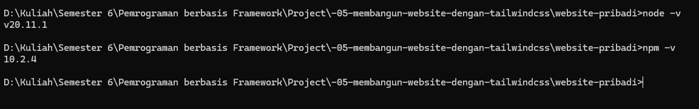
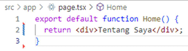
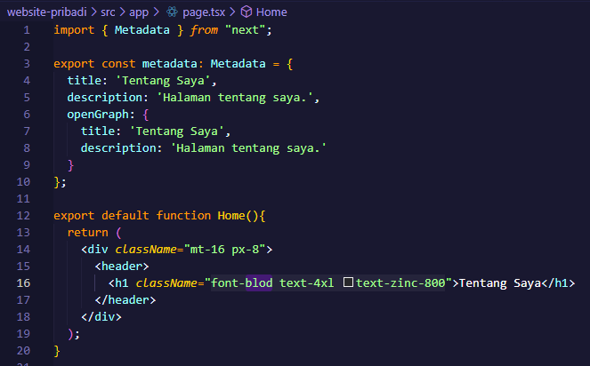

This is a [Next.js](https://nextjs.org) project bootstrapped with [`create-next-app`](https://nextjs.org/docs/app/api-reference/cli/create-next-app).

## Getting Started

First, run the development server:

```bash
npm run dev
# or
yarn dev
# or
pnpm dev
# or
bun dev
```

Open [http://localhost:3000](http://localhost:3000) with your browser to see the result.

You can start editing the page by modifying `app/page.tsx`. The page auto-updates as you edit the file.

This project uses [`next/font`](https://nextjs.org/docs/app/building-your-application/optimizing/fonts) to automatically optimize and load [Geist](https://vercel.com/font), a new font family for Vercel.

## Learn More

To learn more about Next.js, take a look at the following resources:

- [Next.js Documentation](https://nextjs.org/docs) - learn about Next.js features and API.
- [Learn Next.js](https://nextjs.org/learn) - an interactive Next.js tutorial.

You can check out [the Next.js GitHub repository](https://github.com/vercel/next.js) - your feedback and contributions are welcome!

## Deploy on Vercel

The easiest way to deploy your Next.js app is to use the [Vercel Platform](https://vercel.com/new?utm_medium=default-template&filter=next.js&utm_source=create-next-app&utm_campaign=create-next-app-readme) from the creators of Next.js.

Check out our [Next.js deployment documentation](https://nextjs.org/docs/app/building-your-application/deploying) for more details.


## Laporan Praktikum

|  | Pemrograman Berbasis Framework 2024 |
|--|--|
| NIM |  2241720089 |
| Nama |  Putra Nindya Yuwana |
| Kelas | TI - 3C |


### Praktikum 1: Menyiapkan Lingkungan

1. Pas kan Node.js dan npm sudah terinstal di komputer Anda. Anda dapat memeriksanya dengan menjalankan perintah berikut di terminal atau command prompt: node -v npm -v	


2. Buat direktori baru untuk proyek Next.js Anda: mkdir website-pribadi cd website-pribadi	 



3. Inisialisasi proyek Next.js dengan TypeScript dan App Router: npx create-next-app@latest . --typescript –app	 


4. Cek konfigurasi postcss.config.mjs. Cek di app/globals.css, sudah ada import untuk tailwindcss. Lalu buka app/layout.tsx, tambahkan import ‘./globals.css’, dan modifikasi menjadi sebagai berikut:


5. Jalankan aplikasi Next.js:


### Praktikum 2: Membuat Halaman Website

1. Buat file app/page.tsx sebagai halaman "Tentang Saya":



2. Buat file app/projects/page.tsx sebagai halaman "Proyek":


3. Buat file app/essays/page.tsx sebagai halaman "Esai":	 


4. Buka browser dan akses:
 - http://localhost:3000/ untuk halaman "Tentang Saya". 
 - http://localhost:3000/projects untuk halaman "Proyek".
 - http:://localhost:3000/essays untuk halaman "Esai".	   


### Praktikum 3: Membuat Layout dan Navigasi

1. Buat direktori src/components jika belum ada. Lalu buat file src/components/Layout.tsx:	 


2. Buat file src/components/Navbar.tsx


3. Buat file src/components/Footer.tsx


4. Update file app/layout.tsx untuk menggunakan layout:


5. Update setiap halaman menambahkan metadata dengan generateMetadata:




6. Lakukan hal yang sama untuk halaman projects/page.tsx dan essays/page.tsx.	 


### Praktikum 4: Membuat Halaman Proyek dengan Grid Responsif

1. Buat folder di public/images. Kemudian tambahkan dua image, lalu rename dengan nama project1.png dan project2.png


2. Modifikasi file app/projects/page.tsx:


3. Simpan file dan buka http://localhost:3000/projects di browser. Anda akan melihat da ar proyek dalam grid yang responsif.	 


### Tugas

#### Eksplorasi Tailwindcss, kemudian:
1. Modifikasi halaman "Esai" dengan Grid da ar ar kel yang telah ditulis	
2. Modifikasi halaman “Tentang Saya” Buat tampilan yang menarik	

##### Code


##### Output


~ ~ TERIMA KASIH ~ ~

